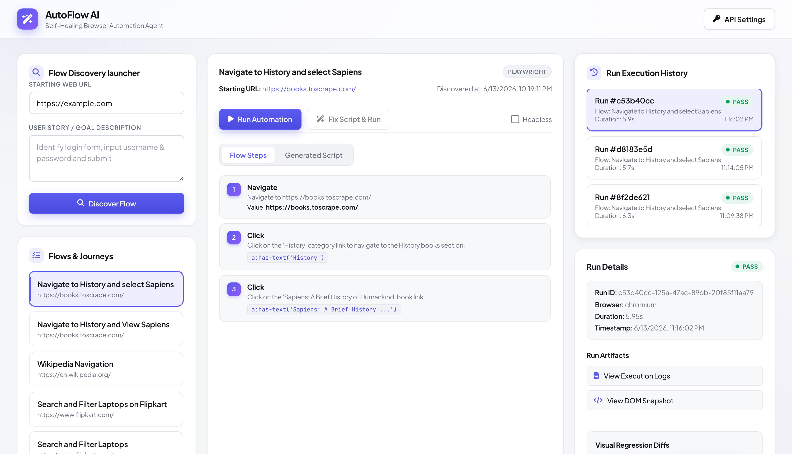

# 🪄 AutoFlow AI — Self‑Healing Browser Automation Agent

AutoFlow AI turns a plain‑English goal into a **runnable browser‑automation script**, executes it, and **automatically diagnoses and repairs failures** when selectors break or pages change. It pairs a multi‑agent LLM pipeline with Playwright and a clean web dashboard.

> Example: type *“Search OpenAI, go to Corporate structure, click the holding‑company link”* → AutoFlow drives a real browser, discovers each step on the live page, generates a Playwright script, runs it, records screenshots/logs, and self‑heals if anything fails.

---

## 📸 Screenshot



*Three‑panel dashboard: discover flows (left), review steps & generated script and run automation (center), inspect run history, artifacts, and self‑healing diagnostics (right).*

---

## ✨ Features

- **Agentic, live flow discovery** — drives a real browser and decides each step against the *current* page’s DOM, so multi‑page journeys (search → navigate → click, login, checkout, menus, toggles) work reliably. Every selector is validated on the live page before it’s recorded.
- **Deterministic script generation** — the executable Playwright harness (imports, browser setup, error reporting, overlay‑resistant clicks, load‑waiting) is fixed code; the LLM only fills in the steps. No more half‑broken scripts.
- **Self‑healing execution** — on failure it diagnoses the root cause (broken selector, timeout, overlay interception, …) and patches the script, then re‑runs.
- **Visual regression** — promote a run’s screenshot to a baseline and get a pixel‑diff overlay against future runs.
- **Bring‑your‑own LLM** — works with any OpenAI‑compatible endpoint (OpenAI, OpenRouter, local Ollama/vLLM). API keys live only in your browser’s local storage.
- **Polished dashboard** — discover, edit scripts, run (headed or headless), inspect logs/screenshots, and view healing diagnostics.

---

## 🤖 The Agents

| Agent | File | Responsibility |
|---|---|---|
| **Flow Discovery** | `agents/flow_discovery.py` | Drives a live browser and, step‑by‑step, picks the next real element to satisfy the goal. Produces a validated `FlowSchema`. |
| **Script Generator** | `agents/script_generator.py` | Wraps the LLM‑produced step statements in a fixed, overlay‑resistant Playwright harness. |
| **Execution Agent** | `agents/execution_agent.py` | Runs the generated script as a subprocess, captures screenshots/DOM snapshots/logs, and reports pass/fail. |
| **Error Diagnosis** | `agents/error_diagnosis.py` | Analyzes a failed run (log + DOM snapshot) and classifies the error with repair suggestions. |
| **Adaptive Repair** | `agents/adaptive_repair.py` | Patches the script based on the diagnosis (e.g. swap selector, dismiss overlay, force click). |
| **Regression Monitor** | `agents/regression_monitor.py` | Compares a run screenshot against a baseline and renders a highlighted diff. |

The **Orchestrator** (`core/orchestrator.py`) ties them together: *generate → run → (on fail) diagnose → repair → re‑run* up to N attempts, then optional visual diff.

---

## 🧱 Tech Stack

- **Language:** Python 3.10+ (tested on 3.13)
- **Web/API:** FastAPI + Uvicorn
- **Browser automation:** Playwright (Chromium)
- **AI layer:** any OpenAI‑compatible Chat Completions API (OpenAI / OpenRouter / local)
- **Storage:** SQLite (auto‑created `db.sqlite`)
- **Visual diff:** Pillow
- **Frontend:** vanilla HTML/CSS/JS (no build step)

---

## 🚀 Quick Start

### 1. Prerequisites
- **Python 3.10+**
- A working internet connection (for the LLM API and target sites)
- An API key for **OpenAI** *or* **OpenRouter** (or a local OpenAI‑compatible server)

### 2. Get the code
```bash
git clone <your-repo-url>
cd AI_Browser_Automation_Agent
```

### 3. Create a virtual environment (recommended)
```bash
python -m venv .venv
source .venv/bin/activate        # macOS/Linux
# .venv\Scripts\activate         # Windows (PowerShell)
```

### 4. Install dependencies
```bash
pip install -r requirements.txt
python -m playwright install chromium
```
> `python -m playwright install chromium` downloads the browser Playwright drives. It’s required — `pip install` alone is not enough.

### 5. Run the app
```bash
python api/main.py
```
Open **http://127.0.0.1:8000** in your browser.

### 6. Configure your API key (in the UI)
Click **API Settings** (top‑right) and enter:
- **Provider:** OpenAI or OpenRouter
- **API Key:** your key (stored only in your browser’s local storage)
- **Model (optional):** e.g. `gpt-4o`, `anthropic/claude-3.5-sonnet`, `meta-llama/llama-3.1-70b-instruct`

> 💡 An OpenRouter key (`sk-or-…`) is auto‑routed to OpenRouter even if the provider dropdown says OpenAI.

---

## 🖱️ Using the Dashboard

1. **Discover** — enter a **Starting URL** and a **Goal** (plain English), click **Discover Flow**. AutoFlow drives the browser live and records the steps.
2. **Review steps** — the middle panel shows each discovered step with its real selector.
3. **Generated Script** — open this tab to generate (or view) the runnable Playwright script. Use **Regenerate** to rebuild it, **Save Changes** to persist manual edits.
4. **Run Automation** — executes the script. Leave **Headless** unchecked to watch a real browser window (recommended; many sites block headless).
5. **Self‑heal** — if a run fails, **Fix Script & Run** lights up: it diagnoses, patches, and re‑runs automatically.
6. **Inspect** — the right panel shows run history, logs, DOM snapshots, and (if a baseline is set) the visual diff.
7. **Visual regression** — on a passing run, click **Set as Baseline**; future runs show a **View Visual Diff**.

---

## 🔌 API Reference

All LLM‑calling endpoints accept these headers: `X-API-Key` (required), `X-API-Provider` (`openai`|`openrouter`), `X-API-Base-Url` (optional), `X-API-Model` (optional).

Interactive docs are available at **http://127.0.0.1:8000/docs**.

| Method | Endpoint | Description |
|---|---|---|
| `POST` | `/api/flows/discover` | Discover a flow from `{ url, goal }`. |
| `GET` | `/api/flows` | List all discovered flows. |
| `GET` | `/api/flows/{flow_id}` | Get a single flow. |
| `POST` | `/api/flows/{flow_id}/generate` | Generate the Playwright script for a flow. |
| `GET` | `/api/flows/{flow_id}/script` | Read the saved script (no LLM call). |
| `PUT` | `/api/flows/{flow_id}/script` | Save edited script content `{ code }`. |
| `POST` | `/api/runs` | Run a flow: `{ flow_id, browser, headless, max_repair_attempts }`. |
| `GET` | `/api/runs?flow_id=` | List runs (optionally filtered by flow). |
| `GET` | `/api/runs/{run_id}` | Get a run report. |
| `GET` | `/api/runs/{run_id}/diagnosis` | Get the self‑healing diagnosis for a run. |
| `GET` | `/api/runs/{run_id}/artifacts` | Artifact URLs (screenshot, DOM, log, diff). |
| `POST` | `/api/regression/baseline` | Promote a run screenshot to baseline `{ flow_id, run_id }`. |
| `GET` | `/api/regression/{flow_id}` | Get baseline status for a flow. |

**Example — run a flow via curl:**
```bash
curl -X POST http://127.0.0.1:8000/api/runs \
  -H "X-API-Key: sk-or-v1-..." \
  -H "X-API-Provider: openrouter" \
  -H "Content-Type: application/json" \
  -d '{"flow_id":"<id>","browser":"chromium","headless":false,"max_repair_attempts":3}'
```

---

## 🗂️ Project Structure

```
AI_Browser_Automation_Agent/
├── agents/
│   ├── flow_discovery.py        # Agentic live flow discovery
│   ├── script_generator.py      # Deterministic Playwright harness + LLM steps
│   ├── execution_agent.py       # Runs scripts, captures artifacts
│   ├── error_diagnosis.py       # Classifies failures
│   ├── adaptive_repair.py       # Patches broken scripts
│   └── regression_monitor.py    # Pixel-diff visual regression
├── api/
│   ├── main.py                  # FastAPI entrypoint (serves API + dashboard)
│   └── routes/                  # flows.py, runs.py, regression.py
├── core/
│   ├── orchestrator.py          # End-to-end self-healing workflow
│   ├── schema.py                # Pydantic models (FlowSchema, RunReport, …)
│   ├── storage.py               # SQLite persistence
│   └── llm.py                   # OpenAI-compatible LLM client + provider/model routing
├── static/                      # index.html, style.css, app.js (dashboard)
├── scripts/generated/           # Generated Playwright scripts (per flow)
├── artifacts/                   # Run screenshots, DOM snapshots, logs, diffs (auto-created)
├── tests/test_agents.py         # Unit tests
├── requirements.txt
├── db.sqlite                    # Auto-created on first run
└── README.md
```

---

## ⚙️ Configuration Notes

- **API keys** are entered in the dashboard and stored in **browser local storage** — never written to the server.
- **Default model** per provider lives in `core/llm.py` (`DEFAULT_MODELS`). Override per request via the **Model** field / `X-API-Model` header, or globally via the `LLM_MODEL` environment variable.
- **Server port** is `8000` (`api/main.py`). Change it there if needed.
- **Headed vs headless:** the **Headless** checkbox in the UI controls each run. Headed (default) matches running the script manually and is far less likely to be blocked.

---

## 🧪 Tests

```bash
python -m unittest tests/test_agents.py
```

---

## 🛠️ Troubleshooting

| Symptom | Cause / Fix |
|---|---|
| `ModuleNotFoundError: No module named 'playwright'` | Run `pip install -r requirements.txt` **and** `python -m playwright install chromium` inside your active venv. |
| `Authentication failed (401)` | Key doesn’t match the provider. OpenAI keys = `sk-…`; OpenRouter keys = `sk-or-…`. Check the key has credits. |
| Run fails on a real site with a “Continue shopping” / CAPTCHA page | The site is blocking automation (e.g. Amazon). Run **headed** (uncheck Headless); for clean demos use friendly sites like `saucedemo.com`, `books.toscrape.com`, `the-internet.herokuapp.com`. |
| A selector times out | Click **Fix Script & Run** — the self‑healing loop diagnoses and patches it. Or **Regenerate** / re‑discover the flow. |
| Discovery stops early on a long journey | Make sure the **Starting URL** is where the journey begins; very long flows cap at `MAX_STEPS` in `flow_discovery.py`. |
| Port 8000 already in use | Change the port in `api/main.py`. |

---

## ⚠️ Known Limitations

- Elements inside **iframes** and links that open in a **new browser tab** aren’t followed.
- Pure `<div>` click handlers with no `role`/`onclick`/`tabindex` may not be detected as interactive.
- Discovery makes several LLM calls (one per step + retries) — it’s a one‑time cost per flow.
- Heavily bot‑protected sites (e.g. Amazon) may block automation regardless of stealth settings.

---

## 🤝 Contributing

Contributions are welcome!

1. Fork the repo and create a feature branch: `git checkout -b feature/my-change`
2. Set up the dev environment (see **Quick Start**) and make your change.
3. Run the tests: `python -m unittest tests/test_agents.py`
4. Keep the style consistent with the surrounding code; prefer small, focused commits.
5. Open a Pull Request describing the change and how you tested it.

Good first areas: broader element extraction (iframes, new‑tab links), more diagnosis/repair heuristics, and additional regression tooling.

---

## 📄 License

Released under the **MIT License** — see [`LICENSE`](LICENSE). Use for educational and **authorized** testing only; do not automate sites you don’t have permission to test.
